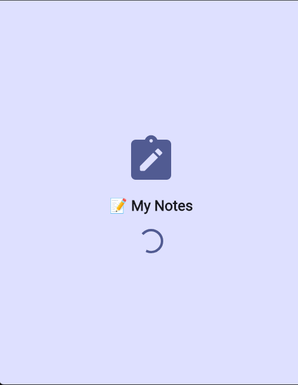
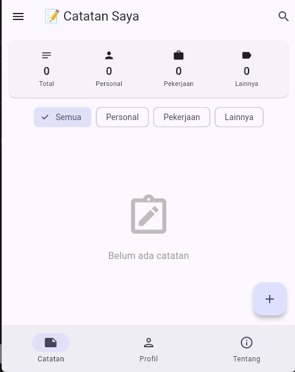
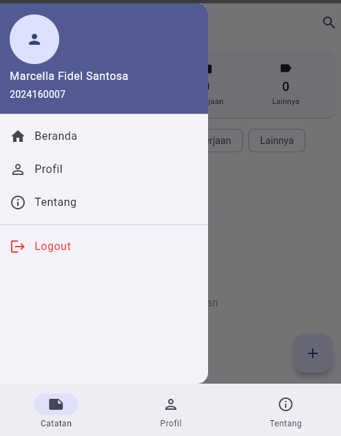
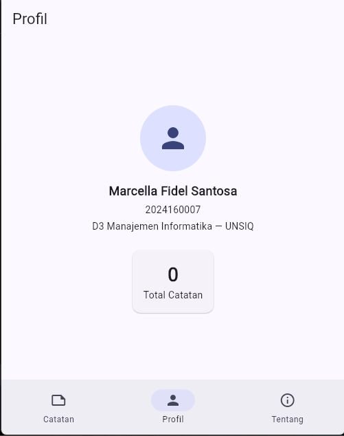
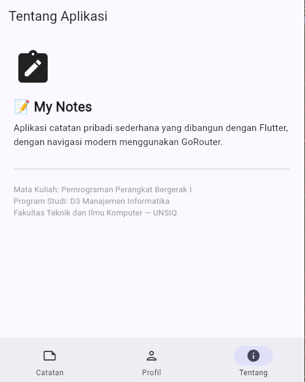
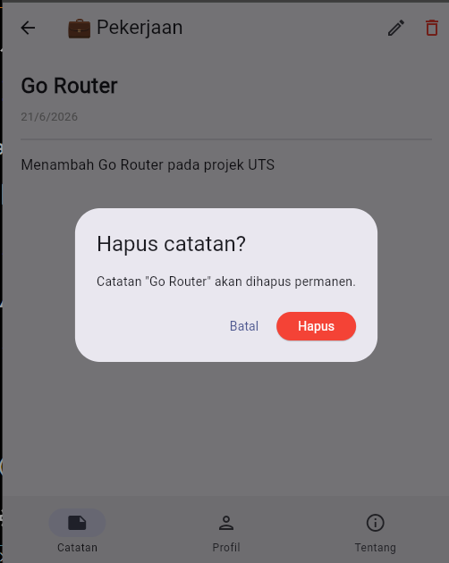
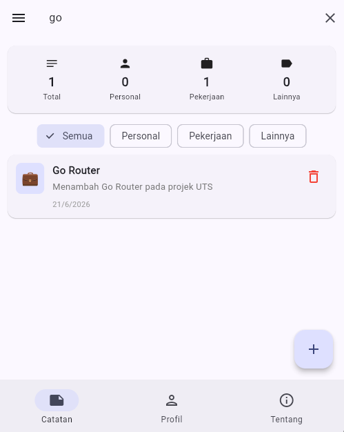
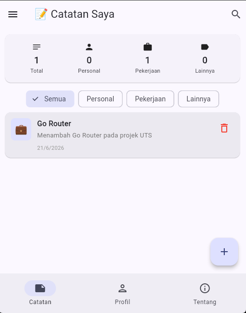

# 📝 My Notes - Aplikasi Catatan Pribadi

## Identitas
- **Nama**: [Marcella Fidel Santosa]
- **NIM**: [2024160007 ]
- **Kelas**: [Manajemen Informatika / 04]

## Daftar Fitur

### Fitur Wajib
- ✅ Menampilkan daftar catatan dengan ListView.builder
- ✅ Card statistik jumlah catatan per kategori
- ✅ Filter catatan berdasarkan kategori (Semua, Personal, Pekerjaan, Lainnya)
- ✅ Tambah catatan via BottomSheet dengan validasi form
- ✅ Hapus catatan dengan konfirmasi AlertDialog
- ✅ SnackBar feedback setelah tambah/hapus catatan
- ✅ Fitur UNDO setelah hapus catatan
- ✅ Empty state saat belum ada catatan
- ✅ Material Design 3

### Fitur Bonus
- 💎 Search bar real-time filter berdasarkan judul
- 💎 Animasi saat menampilkan catatan (SizeTransition)
- 💎 Halaman detail catatan saat card di-tap

## Screenshot
### Halaman Utama

### Tambah Catatan

### Hapus Catatan

### Halaman Detail

### Search

### Setelah Ditambah

Fitur Navigasi & Routing (Pertemuan 9 - GoRouter)

🧭 Routing modern menggunakan GoRouter (menggantikan Navigator 1.0)
🧭 Splash Screen tampil 3 detik lalu redirect otomatis ke halaman utama
🧭 Bottom Navigation dengan StatefulShellRoute.indexedStack (3 tab: Catatan, Profil, Tentang) — state setiap tab tetap terjaga saat berpindah tab
🧭 Drawer di halaman Catatan berisi menu Beranda, Profil, Tentang, dan Logout
🧭 Path parameter (/home/note/:id dan /home/note/edit/:id) untuk membuka detail dan edit catatan berdasarkan ID
🧭 Halaman Edit Catatan dengan form pre-filled, hasil edit langsung tersimpan dan ter-update di semua halaman
🧭 Animasi transisi custom:

Slide dari bawah saat membuka halaman Detail Catatan
Fade saat membuka tab Tentang

🧭 NotesRepository sebagai single source of truth (data catatan dapat diakses dari Home, Detail, dan Edit secara konsisten menggunakan ChangeNotifier)
🧭 Struktur kode terorganisir per folder: models/, data/, pages/, router/, widgets/

Struktur Folder

lib/
├── main.dart                      # Entry point, MaterialApp.router
├── data/
│   └── notes_repository.dart      # Single source of truth data catatan
├── models/
│   └── note_model.dart            # Model Note & enum Category
├── pages/
│   ├── splash_page.dart
│   ├── home_page.dart
│   ├── note_detail_page.dart
│   ├── note_edit_page.dart
│   ├── profile_page.dart
│   └── about_page.dart
├── router/
│   ├── app_router.dart            # Konfigurasi GoRouter
│   └── main_scaffold.dart         # Scaffold + Bottom NavigationBar
└── widgets/
    └── note_card.dart

Screenshot

## Splash Screen

## Halaman Utama (Tab Catatan)

## Drawer

## Bottom Navigation - Tab Profil

## Bottom Navigation - Tab Tentang

## Halaman Detail Catatan dan Edit

## Hapus Catatan

## Search

## Setelah Ditambah

