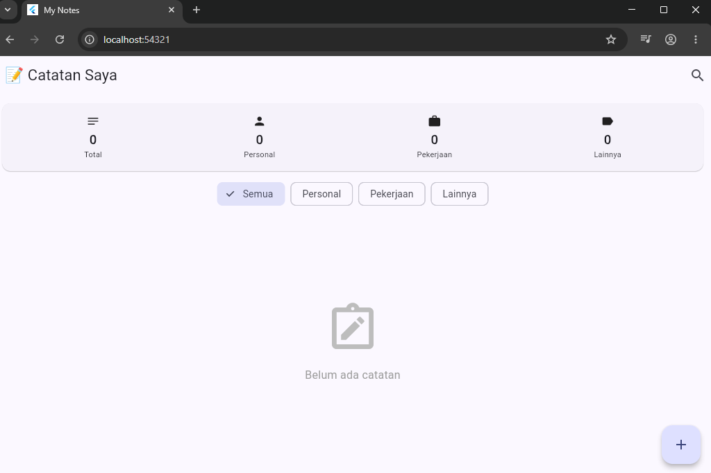
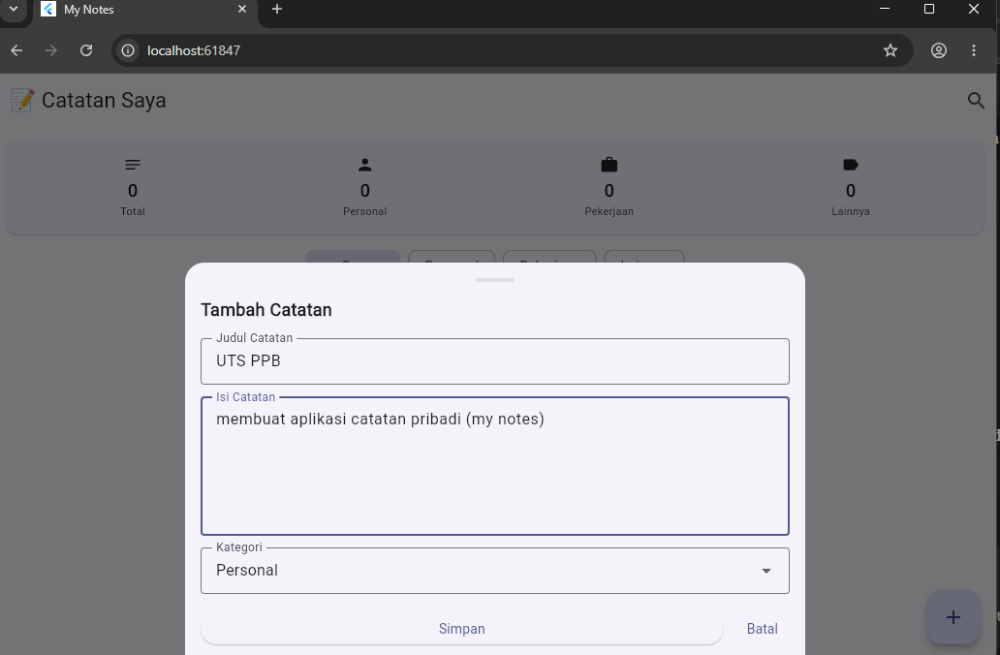
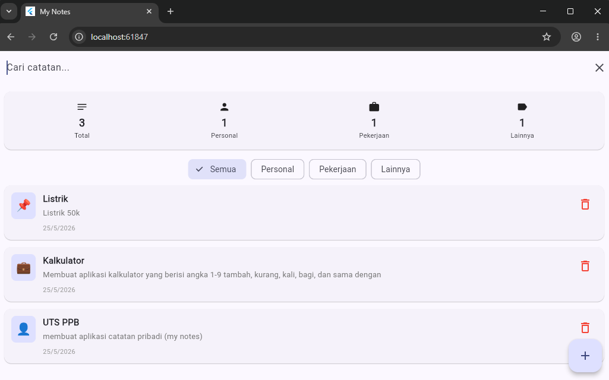
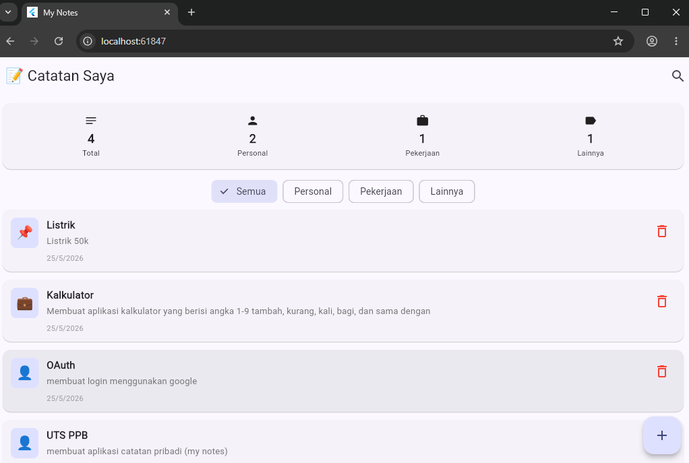

# 📝 My Notes - Aplikasi Catatan Pribadi

## Identitas
- **Nama**: [Marcella Fidel Santosa]
- **NIM**: [2024160007 ]
- **Kelas**: [Manajemen Informatika / 04]

## Daftar Fitur

### Fitur Wajib
- ✅ Menampilkan daftar catatan dengan ListView.builder
- ✅ Card statistik jumlah catatan per kategori
- ✅ Filter catatan berdasarkan kategori (Semua, Personal, Pekerjaan, Lainnya)
- ✅ Tambah catatan via BottomSheet dengan validasi form
- ✅ Hapus catatan dengan konfirmasi AlertDialog
- ✅ SnackBar feedback setelah tambah/hapus catatan
- ✅ Fitur UNDO setelah hapus catatan
- ✅ Empty state saat belum ada catatan
- ✅ Material Design 3

### Fitur Bonus
- 💎 Search bar real-time filter berdasarkan judul
- 💎 Animasi saat menampilkan catatan (SizeTransition)
- 💎 Halaman detail catatan saat card di-tap

## Screenshot
### Halaman Utama

### Tambah Catatan

### Hapus Catatan

### Halaman Detail

### Search

### Setelah Ditambah
